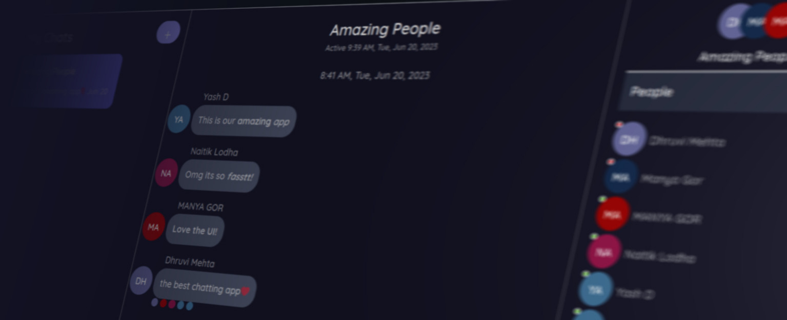

# This is a guide to using the ChatApp 

### First Open the website. [Link](https://chatapp-next.netlify.app/)
 

### On Opening you would be greeted by the following page

Kindly Click on the Login with Google Button which would prompt you in a diffrent window to login by Google.   
*Only the Profile Photo, Display Name and Email are Collected from the account for the session*

 

### After Loging in Succesfully you would be greeted by the following page

 

### To Create a new chat, personal or group, make a new emty chat by clicking on the plus button and enter any chat title

 

### Once chat is created, it should show up on our screen and enter into it. If the chat doesnt seem to be created, try reloading the page

 

### To add users, on the right side of the chat window, the settings column, there would be a tab called "People" which allows you to ***add users from all over the website with their Google Display Name as Username***

*For testing purposes, you could add "Yash D" or "Naitik Lodha" and we would respond right back :)*

 

### To Delete the chat permanently, go to "Options" Tab and Click delete

 

### Notification

If you are sending a message to an inactive user, an email is send to notify them of you message
